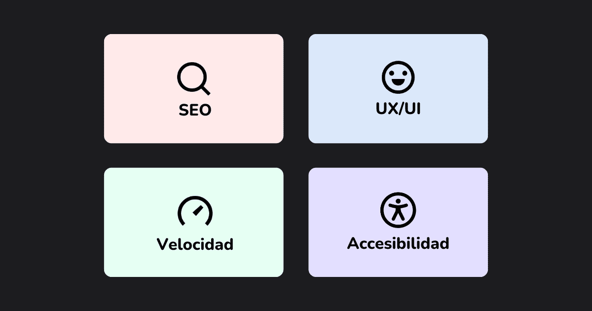
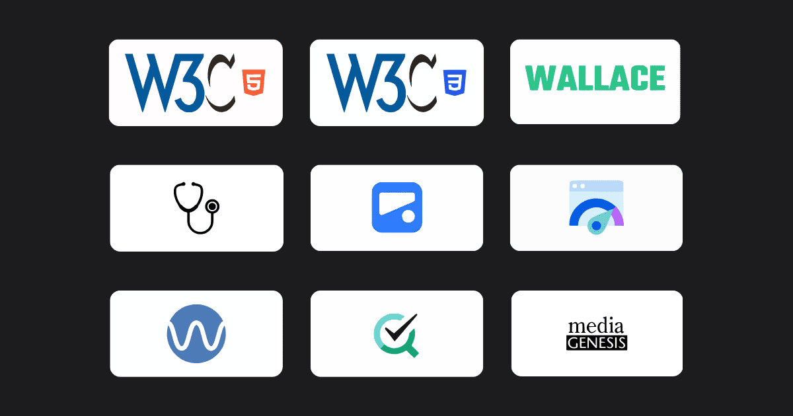
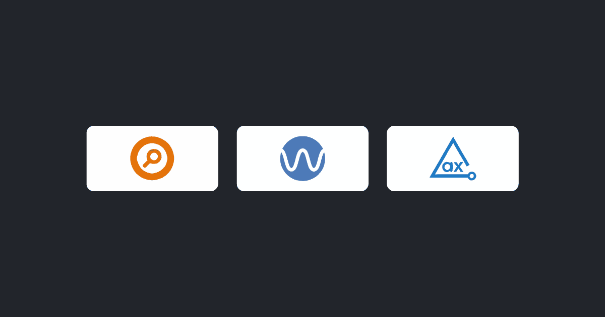
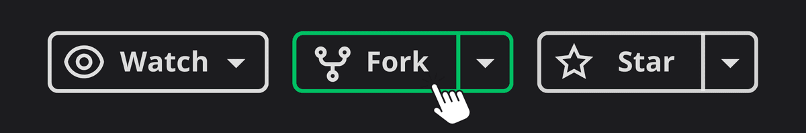

# Optimizador Web: Un Recurso Integral para la Optimización de Sitios Web

**Optimizador Web** es una herramienta diseñada para ayudar a los desarrolladores a cumplir con los más altos estándares en UX/UI, velocidad y accesibilidad.

Ofrece:

- Listas de verificación interactivas
- Herramientas online
- Extensiones útiles

Es ideal tanto para desarrolladores novatos como para expertos que buscan mejorar la calidad y eficiencia de sus proyectos web.

## Tabla de Contenidos

1. [Vista previa](#vista-previa)
2. [Cómo comenzar a utilizar este recurso](#cómo-comenzar-a-utilizar-este-recurso)
3. [Áreas de verificación disponibles](#áreas-de-verificación-disponibles)
4. [Herramientas online disponibles](#herramientas-online-disponibles)
5. [Extensiones recomendadas](#extensiones-recomendadas)
6. [Sugerencias](#sugerencias)
7. [Contribuciones](#contribuciones)
8. [Reportar problemas](#reportar-problemas)
9. [Desarrollado por](#desarrollado-por)

## Vista previa


## Cómo comenzar a utilizar este recurso

1. Ingresa al sitio web [Optimizador Web](https://optimizadorweb.site/)

2. Explora las áreas de verificación interactivas y marca las casillas para saber si tu sitio
   o aplicación está siguiendo las mejores prácticas. ¡A medida que completas las listas de verificación, una barra de progreso se actualiza para que alcances el 100%!



3. Usa herramientas externas para analizar el rendimiento de tu sitio o aplicación en tiempo real. Solo necesitas ingresar la URL.



4. Mejora tu flujo de trabajo con extensiones recomendadas que detectan problemas al instante.



## Áreas de verificación disponibles

- Configuraciones básicas
- UX/UI - Prácticas de usabilidad
- Velocidad y rendimiento general
- Accesibilidad

## Herramientas online disponibles

- Validador W3C de HTML
- Validador W3C de CSS
- Project Wallace
- Dr. Link Check
- Meta Tags
- PageSpeed Insights
- Wave
- Accessibility Checker
- Responsive Design Checker

## Extensiones recomendadas

- Meta Explorer
- Wave
- Axe DevTools

## Sugerencias

Si tienes ideas para mejorar el recurso, nuevas herramientas para añadir o cualquier otra sugerencia, ¡estoy abierto a escucharte!

- 🔗 Conéctate conmigo en LinkedIn [Luciano Treachi](https://www.linkedin.com/in/luciano-treachi/)

- ✉️ Envíame un email a: [lucianotreachi@outlook.com](mailto:lucianotreachi@outlook.com)

Mi compromiso es hacer de este recurso el más completo y útil para todos los desarrolladores web.

## Contribuciones

Si deseas contribuir al proyecto y ayudar a mejorar este recurso, sigue estos pasos para hacer tu contribución.

### 1. Realiza un fork del repositorio

Haz clic en el botón de Fork en GitHub para crear tu copia del proyecto.



### 2. Clona el repositorio

Descarga el repositorio en tu computadora local.

```bash
git clone https://github.com/LucianoTreachi/optimizador-web.git
```

### 3. Crea una rama para tus cambios

Utiliza un nombre descriptivo para tu rama, indicando la funcionalidad o mejora que implementarás.

```bash
git checkout -b nombre-de-la-rama
```

### 4. Realiza los cambios y sube tu rama

Una vez que hayas finalizado los cambios y corroborado que todo funciona correctamente, sube tu rama al repositorio remoto.

```bash
git add .
git commit -m "Descripción breve de los cambios realizados"
git push origin nombre-de-la-rama
```

> [!IMPORTANT]
> Los mensajes de los commits deben seguir el estilo de redacción actual: en español, comenzando con un verbo en infinitivo, por ejemplo: "Añadir", "Implementar", "Actualizar", "Reemplazar", "Corregir", etc.

### 5. Crea un Pull Request

Desde tu repositorio en GitHub, envía un Pull Request con una descripción detallada de tus cambios para que puedan ser revisados e integrados.


¡Tu contribución será de gran ayuda!

### Sugerencias para contribuir

**• Ideas de mejora**: Si tienes una idea para una nueva funcionalidad o herramienta, ¡compártela! Puedes abrir un Issue para discutir tu propuesta antes de comenzar a trabajar.

**• Corrección de errores**: Si encuentras algún problema en el sitio, por pequeño que sea, reportarlo o corregirlo será de gran ayuda.

**• Documentación**: Si crees que alguna sección del README u otra parte de la documentación podría mejorarse, siéntete libre de hacerlo.

## Reportar problemas

Si encuentras algún error, por favor abre una **issue** en GitHub para discutirlo:

Abre un Issue aquí → [Issues](https://github.com/LucianoTreachi/optimizador-web/issues)

## Desarrollado por

**Luciano Treachi**

Soy un Desarrollador Frontend dedicado a crear soluciones web eficientes, accesibles, intuitivas y fáciles de usar que potencian la experiencia del usuario.

[](https://lucianotreachi.website/)
[](https://www.linkedin.com/in/luciano-treachi/)
